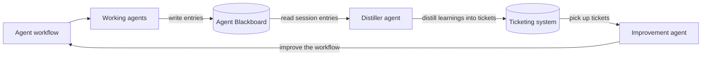

# agent-blackboard

A session-scoped entry stream for autonomous agents — not a knowledge base.

Agents create explicit sessions, append unstructured JSON entries while they work, and read those
entries back later. Root sessions have `parentSessionId: null`; every subagent creates a separate
session whose `parentSessionId` is its direct parent. The service generates timestamps only: callers
always provide session ids, and an entry is identified by `(sessionId, createdAt)`.

## Improvement loop

The project applies the [blackboard design pattern](<https://en.wikipedia.org/wiki/Blackboard_(design_pattern)>)
to agent workflow improvement:



## Architecture

- `packages/server` — Lambda + DynamoDB service deployed with CloudFormation.
- `packages/agent-blackboard` — published as `agent-blackboard`; client library, CLI,
  and MCP server.
- `plugins/agent-blackboard` — Claude Code and Codex plugin with MCP registration and usage skill.

DynamoDB uses one table with multiple items: one metadata item per session and one item per entry.
Entries are never stored in a nested array. Archival is session-level and blocks further reads and
writes.

## Quick start

```sh
export AGENT_BLACKBOARD_URL=https://your-deployment.lambda-url.us-east-1.on.aws
export AGENT_BLACKBOARD_TOKEN=abb_sk_...

agent-blackboard sessions create root-123
agent-blackboard sessions create worker-456 --parent-session-id root-123
agent-blackboard append --session-id worker-456 '{"note":"found a flaky retry"}'
agent-blackboard get --session-id worker-456 --format markdown
```

Create client credentials with an admin token:

```sh
agent-blackboard credentials create --name "my laptop"
```

## Deploy and teardown

```sh
pnpm --dir packages/server run deploy
pnpm --dir packages/server run teardown
```

See [CloudFormation deployment](docs/cloudformation.md) for prerequisites and configuration.

## Documentation

- [Architecture](docs/architecture.md)
- [CLI](docs/cli.md)
- [MCP tools](docs/mcp.md)
- [Agent hosts](docs/agent-hosts.md)
- [End-to-end smoke test](docs/smoke-test.md)
- [Loop engineering](docs/loop-engineering.md)

## Configuration

| Variable                             | Used by        | Meaning                           |
| ------------------------------------ | -------------- | --------------------------------- |
| `AGENT_BLACKBOARD_TABLE`             | server         | DynamoDB table name               |
| `AGENT_BLACKBOARD_TTL_DAYS`          | server         | Entry retention; default 90 days  |
| `AGENT_BLACKBOARD_ADMIN_CREDENTIALS` | server         | Base64 JSON admin credential list |
| `AGENT_BLACKBOARD_URL`               | client/CLI/MCP | Server base URL                   |
| `AGENT_BLACKBOARD_TOKEN`             | client/CLI/MCP | Client credential                 |
| `AGENT_BLACKBOARD_ADMIN_TOKEN`       | CLI            | Admin credential                  |

## License

MIT
