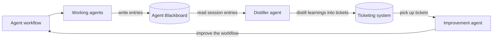

# agent-blackboard

A session-scoped entry stream for autonomous agents — not a knowledge base.

Agents create explicit sessions, append unstructured JSON entries while they work, and read those
entries back later. Root sessions have `parentSessionId: null`; every subagent creates a separate
session whose `parentSessionId` is its direct parent. Callers also provide the agent name and
version. The service generates timestamps only, and an entry is identified by
`(sessionId, createdAt)`.

## Improvement loop

The project applies the [blackboard design pattern](<https://en.wikipedia.org/wiki/Blackboard_(design_pattern)>)
to agent workflow improvement:



## In-Session Telemetry

`agent-blackboard` is designed to run within an agent session.
There are two main reasons:

1. In most agentic tools, thinking is not returned to the user and saved to the session logs. If you run retrospectives by reading session logs, you might miss a lot of the thought process, which is something you'd want to improve (e.g. improve the harness so less thinking is required).
2. In-session, the session logs are already cached whereas re-reading session logs will not be cached. Sure, you can use a cheaper agent to search, but again, thinking will not be included.

Of course, you can read the session logs as part of the distill process or as part of the in-session retrospective. It's all up to you, but out of scope for `agent-blackboard`.

## Architecture

- `packages/server` — Lambda + DynamoDB service deployed with CloudFormation.
- `packages/agent-blackboard` — published as `agent-blackboard`; client library, CLI,
  and MCP server.
- `plugins/agent-blackboard` — Claude Code and Codex plugin with MCP registration and usage skill.

DynamoDB uses one table with multiple items: one metadata item per session and one item per entry.
Entries are never stored in a nested array. Session metadata tracks `lastEntryAt`; each entry
expires relative to its own `createdAt`, while session metadata never expires. Archival is stored
as `archivedAt` and means the session was distilled exactly once. Archived metadata is immutable,
but entries remain appendable and children may reference archived parents.

## Cost

Since everything runs serverless, expect costs to be < $10 per year per engineer.

## Quick start

```sh
export AGENT_BLACKBOARD_URL=https://your-deployment.lambda-url.us-east-1.on.aws
export AGENT_BLACKBOARD_TOKEN=abb_sk_...

agent-blackboard sessions create root-123 --agent claude-code --version 1.0.13
agent-blackboard sessions create worker-456 --parent-session-id root-123 \
  --agent claude-code --version 1.0.13
agent-blackboard append --session-id worker-456 '{"note":"found a flaky retry"}'
agent-blackboard get --session-id worker-456 --format markdown
```

Create client credentials with an admin token:

```sh
agent-blackboard credentials create --name "my laptop"
```

## Install in Codex, Claude Code, Cursor, OpenCode, or Grok

Both installation options run the published package with `npx`; neither requires a local clone of
this repository. Before starting your agent host, export the deployed service URL and a client
credential (never an admin credential):

```sh
export AGENT_BLACKBOARD_URL=https://your-deployment.lambda-url.us-east-1.on.aws
export AGENT_BLACKBOARD_TOKEN=abb_sk_...
```

### Option 1: install the plugin (recommended)

The plugin installs both the usage skill and the MCP server.

For Codex:

```sh
codex plugin marketplace add jonathanong/agent-blackboard
codex plugin add agent-blackboard@agent-blackboard
codex plugin list
```

Start a new Codex thread after installation, then use `/mcp` to confirm that `agent-blackboard` is
connected.

For Claude Code, run these commands inside an interactive session:

```text
/plugin marketplace add jonathanong/agent-blackboard
/plugin install agent-blackboard@agent-blackboard
/reload-plugins
```

Use `/mcp` to confirm that `agent-blackboard` is connected. If installation reports that the
plugin is already active, `/reload-plugins` is unnecessary.

### Option 2: install only the MCP server

This option exposes the MCP tools without installing the usage skill.

For Codex, add this to `~/.codex/config.toml` (or to `.codex/config.toml` in a trusted project):

```toml
[mcp_servers.agent-blackboard]
command = "npx"
args = ["-y", "agent-blackboard@0.5.0", "mcp"]
env_vars = ["AGENT_BLACKBOARD_URL", "AGENT_BLACKBOARD_TOKEN"]
```

Restart Codex and run `codex mcp list` or use `/mcp` in the TUI to verify the connection.

For Claude Code, add this project-scoped `.mcp.json` (or merge the server into an existing file):

```json
{
  "mcpServers": {
    "agent-blackboard": {
      "command": "npx",
      "args": ["-y", "agent-blackboard@0.5.0", "mcp"],
      "env": {
        "AGENT_BLACKBOARD_URL": "${env:AGENT_BLACKBOARD_URL}",
        "AGENT_BLACKBOARD_TOKEN": "${env:AGENT_BLACKBOARD_TOKEN}"
      }
    }
  }
}
```

Start Claude Code in that project, approve the server when prompted, and use `/mcp` or
`claude mcp get agent-blackboard` to verify it. See [MCP tools](docs/mcp.md) and
[agent hosts](docs/agent-hosts.md) for the available operations and explicit-session-id contract.

For Cursor, add the same stdio server to `.cursor/mcp.json` (or `~/.cursor/mcp.json`):

```json
{
  "mcpServers": {
    "agent-blackboard": {
      "command": "npx",
      "args": ["-y", "agent-blackboard@0.5.0", "mcp"],
      "env": {
        "AGENT_BLACKBOARD_URL": "${AGENT_BLACKBOARD_URL}",
        "AGENT_BLACKBOARD_TOKEN": "${AGENT_BLACKBOARD_TOKEN}"
      }
    }
  }
}
```

For OpenCode, add a `type: "local"` server under `mcp` in `opencode.json` and pass the two
environment variables through its `environment` object. Grok custom connectors require a public
remote MCP URL; this package currently exposes stdio only, so Grok is not supported directly.
See [agent hosts](docs/agent-hosts.md) for complete host-specific examples and limitations.

## Deploy and teardown

```sh
pnpm --dir packages/server run deploy
pnpm --dir packages/server run teardown
```

See [CloudFormation deployment](docs/cloudformation.md) for prerequisites and configuration.

## Documentation

- [Architecture](docs/architecture.md)
- [TypeScript API](docs/typescript-api.md)
- [CLI](docs/cli.md)
- [MCP tools](docs/mcp.md)
- [Agent hosts](docs/agent-hosts.md)
- [End-to-end smoke test](docs/smoke-test.md)
- [Loop engineering](docs/loop-engineering.md)

## Configuration

| Variable                             | Used by        | Meaning                           |
| ------------------------------------ | -------------- | --------------------------------- |
| `AGENT_BLACKBOARD_TABLE`             | server         | DynamoDB table name               |
| `AGENT_BLACKBOARD_TTL_DAYS`          | server         | Entry retention; default 90 days  |
| `AGENT_BLACKBOARD_ADMIN_CREDENTIALS` | server         | Base64 JSON admin credential list |
| `AGENT_BLACKBOARD_URL`               | client/CLI/MCP | Server base URL                   |
| `AGENT_BLACKBOARD_TOKEN`             | client/CLI/MCP | Client credential                 |
| `AGENT_BLACKBOARD_ADMIN_TOKEN`       | CLI            | Admin credential                  |

## Harness Ecosystem

This is part of the following harness ecosystem:

- [auto-harness](https://github.com/jonathanong/auto-harness) - non-interactive agent CLI orchestration across sandboxes
- [agent-blackboard](https://github.com/jonathanong/agent-blackboard) - session-scoped telemetry for autonomous agents
- [pr-shepherd](https://github.com/jonathanong/pr-shepherd) - autonomous pull request shepherd
- [no-mistakes](https://github.com/jonathanong/no-mistakes) - deterministic AST-based codebase intelligence, test selection, and linting for agents
