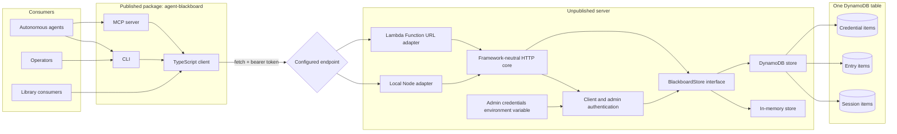

# Architecture

## Request flow

The published package uses `fetch` to call a framework-neutral HTTP core. The same core runs behind
the local Node server and the Lambda Function URL adapter. Production storage uses DynamoDB; tests
and local development can use the in-memory store.

## Data model

One DynamoDB table stores multiple item types. There are no joins and no nested entry arrays.

| Entity     | Partition key                        | Sort key                     | Public fields                                                                                 |
| ---------- | ------------------------------------ | ---------------------------- | --------------------------------------------------------------------------------------------- |
| Session    | `SESSIONS#<credentialId>`            | `SESSION#<sessionId>`        | `id`, `parentSessionId`, `agent`, `version`, `createdAt`, `lastEntryAt`, `archivedAt`, `data` |
| Entry      | `ENTRIES#<credentialId>#<sessionId>` | `ENTRY#<createdAt>`          | `sessionId`, `createdAt`, `data`                                                              |
| Credential | internal credential partition        | internal credential sort key | `id`, `name`, `createdAt`                                                                     |

Each entry is independently writable and queryable. Entry identity is `(sessionId, createdAt)`;
timestamps are allocated by the service and are collision-safe within a session. TTL is an internal
entry attribute derived from `createdAt`.

## Session invariants

- The caller supplies every session id. No layer infers or generates ids. Ids contain only letters,
  numbers, `.`, `_`, `:`, and `-`.
- A root has `parentSessionId: null`.
- A subagent creates its own session with the direct parent's id.
- Parent and child must belong to the same client credential.
- The parent must exist when the child is created; archived parents remain valid.
- Parent relationships are immutable.
- `agent` and `version` are required caller-supplied session metadata.
- Session `data` is unstructured JSON and patches shallow-merge it.
- Every entry append updates `lastEntryAt` and receives a TTL based on its own `createdAt`.
- Archiving sets `archivedAt` exactly once after distillation. Archived sessions and entries remain
  readable; metadata patches are blocked, while entries and new children remain allowed.
- Session metadata has no TTL and remains addressable after all of its entries expire.

DynamoDB transactions combine the session metadata update with each entry write, keeping
`lastEntryAt` monotonic and entry identities unique under concurrent appends.

## HTTP API

| Method          | Path                    | Purpose                                                  |
| --------------- | ----------------------- | -------------------------------------------------------- |
| `POST`          | `/sessions`             | Create `{ id, parentSessionId, agent, version }`         |
| `GET`           | `/sessions`             | List sessions; supports archive and inactivity filters   |
| `GET`           | `/sessions/:id`         | Get session metadata                                     |
| `PATCH`         | `/sessions/:id`         | Patch `{ data }` or archive with `{ archived: true }`    |
| `POST`          | `/sessions/:id/entries` | Append `{ data }`                                        |
| `GET`           | `/sessions/:id/entries` | Stream entries (`json`, `jsonl`, or `markdown`)          |
| `PATCH`         | `/sessions/:id/entries` | Patch `{ createdAt, data }`                              |
| `GET`           | `/snapshot`             | Stream all selected active sessions and entries as JSONL |
| `/credentials*` | admin routes            | Manage client credentials                                |

## Authentication

Client tokens use `abb_sk_<credentialId>_<secret>` and are hashed in DynamoDB. Admin tokens use
`abb_admin_<name>_<secret>` and exist only in the server's
`AGENT_BLACKBOARD_ADMIN_CREDENTIALS` environment variable. Client tokens cannot access credential
routes; admin tokens cannot access session or entry routes.

## Streaming

The store exposes entries as an `AsyncIterable`. The HTTP layer can emit JSON arrays, JSONL, or
Markdown without loading a session's entire entry history. The library defaults to incremental
JSONL parsing; the CLI relays response bytes directly.

`GET /snapshot` streams each selected active session followed by its entries and ends with a
terminal manifest. Session blocks are ordered by `createdAt` (ties have no further ordering
guarantee), and entries by `createdAt` within their session. The snapshot is best-effort rather than transactional: appends concurrent
with the scan may or may not appear. The response is capped at 190 MiB; an oversized stream ends
with a `snapshot_too_large` error record instead of a complete manifest.
