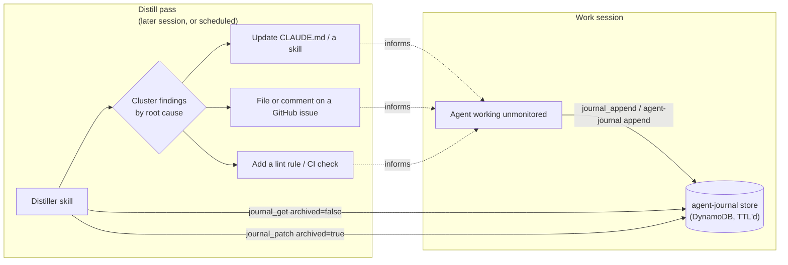

# Loop engineering: closing the self-improvement loop

`agent-journal` only does one thing: store an append-only, unstructured
stream of consciousness per session. It deliberately does **not** ship a
distiller — what counts as a useful learning, and what to do about it, is
project-specific. This doc is about the loop you build _on top of_
`agent-journal` to actually self-improve: journal while working, distill
later, feed the result back into future sessions.

## The loop, at a high level



Three phases:

1. **Write** — while working, an agent journals friction, decisions, and
   findings as they happen (not reconstructed after the fact — see
   [`architecture.md`](architecture.md) on why same-session, contemporaneous
   notes are more reliable than a post-hoc summary).
2. **Distill** — a separate pass (same session before it ends, a fresh
   session, or a scheduled/cron agent) reads back **unarchived** entries,
   clusters them by root cause, and turns the recurring/high-leverage ones
   into something durable: a `CLAUDE.md` edit, a strengthened skill, a
   GitHub issue, a new CI check. It then archives the entries it processed.
3. **Feed back** — the durable output (not the journal itself) is what
   shapes future sessions. The journal is a transient input the distiller
   consumes; the artifact it produces is the actual memory.

This mirrors the `retrospective` → `retrospective-distill` pattern this
project replaces (see the root README), generalized: `agent-journal` is the
storage substrate, and you write the "what to journal" and "how to distill"
skills for your own project.

## Example: a "what to journal" skill

The shipped [`agent-journal` skill](../plugins/agent-journal/skills/agent-journal/SKILL.md)
only explains _how_ to call append/get/patch. Layer a project-specific skill
on top that tells the agent _when_ and _what_:

```markdown
---
name: journal-friction
description: Journal friction, decisions, and dead ends as they happen during implementation work.
when_to_use: During any non-trivial implementation task, as soon as something costs extra turns, fails and gets retried, or a non-obvious decision gets made.
---

# Journal friction as it happens

Whenever one of these happens during this session, call `journal_append`
immediately (don't wait until the end):

- A command/approach failed and you had to retry a different way.
- You made a non-obvious decision (name it and the reason).
- You noticed a gap in docs/tooling that slowed you down.
- Tests were flaky or a fix required more than one attempt.

Attach whatever's useful in `data` — no fixed schema. Include concrete file
paths so a later distill pass doesn't have to reconstruct context:

    { "note": "retry logic in worker.mts silently swallows 429s",
      "file": "src/worker.mts", "kind": "bug-suspect" }
```

## Example: a distiller skill

```markdown
---
name: agent-journal-distill
description: Distill unarchived agent-journal entries into durable follow-ups.
when_to_use: On a schedule, or when asked to review recent journal entries.
---

# Distill agent-journal entries

1. Pull unarchived entries: `journal_get { "archived": false }` (add
   `sessionId`/`agent` filters if you only want a specific scope).
2. Cluster by root cause, not by session. Two or more entries sharing a
   cause are "recurring" — prioritize those.
3. For each recurring theme: check whether it's already tracked (an open
   issue, an existing CLAUDE.md rule) before creating something new.
4. Turn the highest-leverage themes into a durable artifact — a CLAUDE.md
   edit, a strengthened skill, a new lint rule, or a GitHub issue with the
   concrete evidence embedded (the entries get archived next, so don't
   reference them by id in anything long-lived).
5. Archive what you processed:
   `journal_patch { "patches": [{ "id": "...", "archived": true }, ...] }`.
```

## MCP call sequence

A full write → distill round-trip, as MCP tool calls:

During work, as friction happens:

```json
{
  "name": "journal_append",
  "arguments": {
    "data": { "note": "pnpm test:tooling flaked twice under parallel load, passed in isolation" }
  }
}
```

Later, a distiller pass pulls everything unprocessed:

```json
{ "name": "journal_get", "arguments": { "archived": false } }
```

...clusters, decides this is worth a CI note, writes it, then archives what it read:

```json
{
  "name": "journal_patch",
  "arguments": {
    "patches": [
      { "id": "sess-abc#01H8X...", "archived": true },
      { "id": "sess-abc#01H8Y...", "archived": true }
    ]
  }
}
```

## CLI: a scheduled distill

For a distill pass that isn't tied to an interactive agent session — e.g. a
nightly cron job — script it directly against the CLI:

```sh
#!/usr/bin/env sh
# nightly-distill.sh — feed unarchived entries to an agent for distillation,
# then let that agent's own tool calls (journal_patch) archive what it used.

export AGENT_JOURNAL_URL=https://your-deployment.lambda-url.us-east-1.on.aws
export AGENT_JOURNAL_TOKEN=ag_sk_...

entries=$(agent-journal get --all-sessions --archived false --format jsonl)

if [ -z "$entries" ]; then
  echo "Nothing to distill."
  exit 0
fi

# Hand the raw JSONL to your agent runtime of choice as context, e.g.:
#   claude -p "Distill these agent-journal entries: $entries"
# or codex exec, or any other harness — the distiller skill above is what
# tells it what to do with them, including archiving via journal_patch once
# it's extracted the durable value.
```
